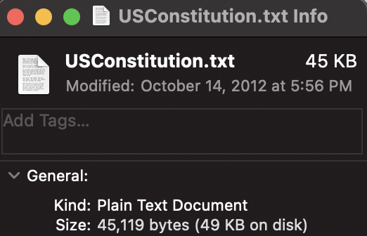
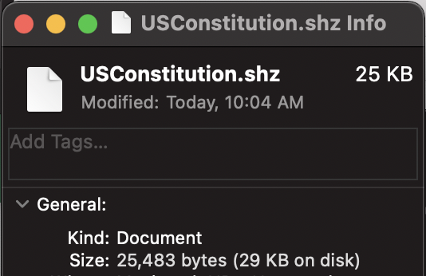
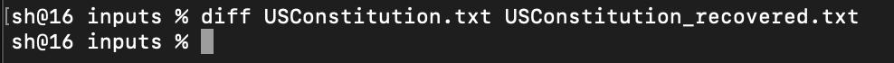
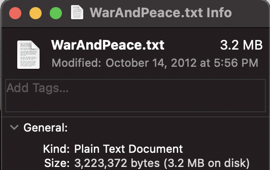
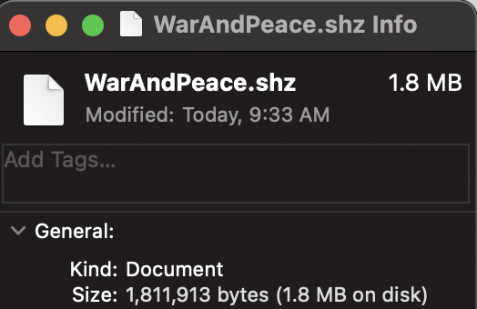
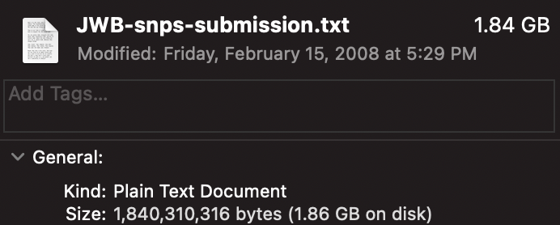
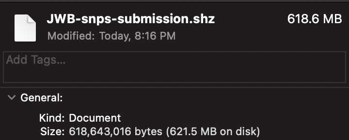
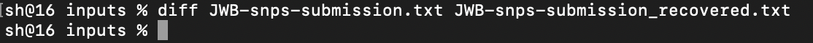

# CS10 PS3 Description

## Huffman Coding

In the `HuffmanCoder` class, `encode` and `decode` are provided as static functions. To compress/decompress a file, pass in the path of the file. For instance `encode('inputs/hello.txt')`.

A few test functions are also provided in `HuffmanCoder`, which are called in `TestHuffman` for easy testing.

## Extra

- The Huffman Tree used to encode the original file is saved in the header of the compressed file, which can be used to decompress the same file later on.
- One of the test case is a DNA sequence.

## Limitation and Edge Cases

All edge cases mentioned in the instructions were tested.

This implementation is made specifically for files that only include ASCII characters.

Saving the tree to the compressed file incurs space overhead, and might cause the compressed file to be bigger than the original for small and uniformly distributed files.

## Test Cases

### US Constitution
The original file.

The compressed file.

`diff` of the original and recovered file.

### War and Peace
The original file.

The compressed file.

### DNA sequence
The DNA sequence (James Watson's genome) used for testing can be downloaded [here](https://www.ics.uci.edu/~dnazip/JWB.tgz).

More information can be found at [https://www.ics.uci.edu/~dnazip/](https://www.ics.uci.edu/~dnazip/).

The original file.

The compressed file.

`diff` of the original and recovered file.
